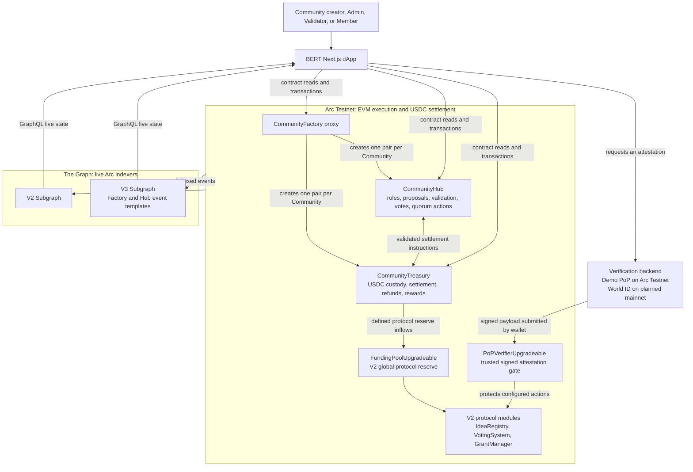

# BERT

BERT is programmable stablecoin-native funding infrastructure for transparent grant allocation, treasury coordination, and milestone-based capital release.

The protocol keeps proposal intake, voting rounds, treasury accounting, and staged grant distribution onchain. Economic flows are USDC-native: proposal deposits, vote commitments, treasury balances, reserve accounting, and grant payouts all settle in USDC-compatible units.

The live voting model can additionally enforce verified-human participation through a dedicated verifier contract. When enabled, voting remains capital-weighted in USDC, but only wallets that pass the configured proof-of-personhood flow may participate, and each wallet is capped per idea vote.

## Verification By Network

### Current Arc Testnet

The public dApp is in active development on Arc Testnet. It uses an explicitly labelled **Demo verification** path so every testnet wallet can exercise the real on-chain `PoPVerifierUpgradeable` gate, protected actions, and voting flows. Demo verification is not proof of personhood and must never be treated as Sybil resistance or an identity check. Its signed provider ID is `BERT_TESTNET_DEMO`.

### Planned Mainnet

Demo verification is disabled for mainnet deployments. The production policy is World ID proof-of-personhood: the backend verifies a World proof, binds one World nullifier to one BERT wallet, and only then signs the on-chain payload. The Solidity contract intentionally stays provider-agnostic; it verifies the trusted backend signature, expiry, nonce, and wallet binding rather than embedding a vendor SDK.

See the public [Testnet Guide](https://bertdao.vercel.app/testnet-information) before using the Arc deployment.

## Problem

Traditional grant programs are often opaque, manual, slow to execute, and difficult to audit. Treasury coordination is fragmented across forms, spreadsheets, chat approvals, and offchain payout operations.

## Solution

BERT turns grant allocation into programmable treasury flow:

1. Builders create proposals with a stake-backed submission flow.
2. Participants commit USDC voting weight during funding rounds.
3. A pledge is bound to one selected idea for that round, not donated to a general winner pool.
4. The highest-supported idea that meets its disclosed post-fee minimum funding target is selected.
5. Losing pledges are refundable by their original voters. If no idea is viable, every pledge is refundable.
6. The protocol fee is fixed when a round opens and moves to reserve only if the winning author starts the grant.
7. The viable winner receives milestone-based USDC releases, while reviewers validate progress before later tranches unlock.

## Why Arc

BERT is designed for Arc’s stablecoin settlement infrastructure.

Arc is not presented here as “just another EVM” or a “cheap chain”. The fit is that Arc is a stablecoin-native execution environment where USDC is central to settlement and fees. That makes it a strong home for treasury coordination, grant disbursement, and programmable capital allocation workflows.

For the current Arc testnet references used in this repo:

1. Arc Testnet chain ID is `5042002`.
2. Public RPC is `https://rpc.testnet.arc.network`.
3. Testnet USDC ERC-20 interface address is `0x3600000000000000000000000000000000000000`.

Sources:
1. Arc docs: `Connect to Arc`
2. Arc docs: `Contract addresses`
3. Circle docs: `USDC Contract Addresses`

## V2 Stake-Backed Funding Flow

```text
Builder creates a proposal with an author bond and minimum net funding target
        |
        v
Author bond is locked in USDC
        |
        v
Participants make one USDC pledge to one idea in the round
        |
        v
VotingSystem selects the highest-supported viable idea after the locked fee
        |
        v
Losers claim their own pledges back
        |
        v
Winner claims a net grant in 30% / 40% / 30% milestones
        |
        v
If the grant is never claimed or expires, defined refunds reopen for winning pledgers
```

The V2 model is not a pooled tournament where a voter who backed a losing idea silently funds a different winner. A pledge remains attributable to its voter and selected idea. The only successful-round fee is a disclosed protocol fee on the winning pledge, and it is finalized only after the winning author claims the grant.

## Core Modules

1. `IdeaRegistryUpgradeable` stores proposals, metadata, author stake requirements, and lifecycle state.
2. `VotingSystemUpgradeable` manages voting rounds and USDC-denominated vote commitments.
3. `FundingPoolUpgradeable` is the USDC treasury and accounting layer.
4. `GrantManagerUpgradeable` coordinates claim flow and milestone-based releases.
5. `RolesRegistryUpgradeable` and `RolesAwareUpgradeable` enforce protocol permissions.
6. `PoPVerifierUpgradeable` stores trusted backend-signed verification attestations used by voting access control.
7. [BERT V3 Community Layer](contracts/BERT/V3/README.md) adds isolated stake-gated governance communities with local Treasuries and V2 reserve integration.

## V3 Architecture At A Glance



### V3 Execution Boundary

Each Community has its own immutable `CommunityHub` and `CommunityTreasury`; the Factory is the shared entry point. The Hub owns local governance state, while the Treasury is the sole USDC custodian. A Hub cannot transfer Community funds directly: it must first satisfy the relevant proposal, settlement, or Admin-quorum state transition and then instruct its paired Treasury.

V3 does not replace V2. Defined Community protocol inflows route into the existing V2 `FundingPoolUpgradeable` reserve, while each Community retains isolated membership, governance, and execution balances. The dApp uses the live V2 and V3 Subgraphs for searchable, event-derived state; smart contracts remain the source of truth.

## Security

1. Upgradeable core modules are deployed behind proxies.
2. `FundingPoolUpgradeable`, `VotingSystemUpgradeable`, and `GrantManagerUpgradeable` are pausable.
3. Treasury transfers use `SafeERC20`.
4. Milestone payout state prevents duplicate release.
5. Role-gated cross-contract calls reduce unauthorized state changes.
6. Verified-human voting can be enabled without embedding any single identity provider directly into the voting contract.

## Development

```bash
npm install
npx hardhat compile
npx hardhat test
```

Local deployment:

```bash
npx hardhat node
npx hardhat run scripts/deploy/deploy-proxies.ts --network localhost
```

Arc testnet deployment:

```bash
cp .env.example .env
npx hardhat run scripts/deploy/deploy-proxies.ts --network arcTestnet
```

If `USDC_ADDRESS` is not set, the deploy script falls back to `MockUSDC` for local/dev environments.

## Docs

1. [Architecture](docs/ARCHITECTURE.md)
2. [Security](docs/SECURITY.md)
3. [Contracts](docs/CONTRACTS.md)
4. [Migration notes](docs/MIGRATION_NOTES.md)
5. [Arc deployment guide](scripts/deploy/docs_deploy/DEPLOY.md)
6. [Upgrades](docs/UPGRADES.md)
7. [BERT V3 Community Layer](contracts/BERT/V3/README.md)
8. [BERT V3 file index](docs/V3-FILE-INDEX.md)

**Disclaimer**
This repository contains the core smart contracts of the protocol. The codebase may evolve rapidly, so older guides may not match the current layout. Refer to the latest docs for accurate integration guidance.

**License**

2026 BERT [info@bertdao](mailto:bertdaoarc@gmail.com)

This program is free software: you can redistribute it and/or modify it under the terms of the GNU General Public License as published by the Free Software Foundation, version 3 of the License, or any later version.

This program is distributed in the hope that it will be useful, but WITHOUT ANY WARRANTY; without even the implied warranty of MERCHANTABILITY or FITNESS FOR A PARTICULAR PURPOSE. See the [GNU General Public License](LICENSE) for more details.

You should have received a copy of the GNU General Public License along with this program. If not, see https://www.gnu.org/licenses/.
